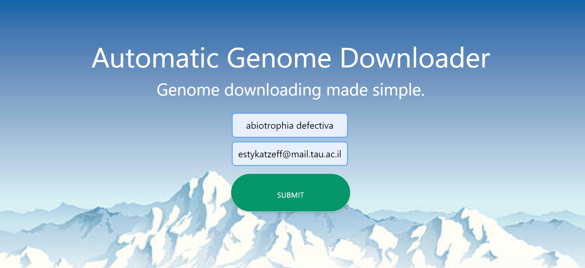

# Automatic Genome Downloader

A webserver for downloading filtered genome assemblies of organisms from NCBI Assembly database. 

## How to use
* Make sure you are connected to the VPN of Tel Aviv University
* Search for the URL: http://genomedownload.tau.ac.il/
* You will see the following page: 
  
  

* Click ```SUBMIT JOB```
* Fill in:
    - ```Organism Name``` - according to organism of interest.
    - ```Email Address``` - your email address to receive notification and URL to the results.
    
    **Example**: 
    
    

 * Click ```SUBMIT```
 * After a few moments you should see ```"Your process is running"```.
 
 * When the process is complete, you will get an email notifying you with a link to the following page: 
 * Choose ```EXPORT``` to download the results to your computer - this will be a ```.zip``` file containing the genome assemblies of the chosen organism, with the chosen filters.
 
## Filters

There are alot of options to filter out genome assemblies of a specified organism.
We will present the filters that are currently being used:
- **Refseq**: ony assemblies that are refseq are being downloaded
- **Assembly Level**: we know of four different assembly levels, ordered from best to least: Complete Genome, Chromosome, Scaffold, Contig.
- **Date**: The most recent update date of this assembly.

Currently the code filters only according to ```Refseq```.
The options of filtering according to ```Assembly Level``` and ```Date``` are available in the code (as inputs), 
but need to be adjusted to the back and front end code to allow the users the option to choose the filters they are interested in.   

## Code
The code can be found in the university server in two different places:
 1. Full back and front end code - in powerweb2 (bioseq user): ```/data/www/flask/genomedownload/```
 2. Code for downloading and filtering the genomes - in power9login: 
    - ```/groups/pupko/estykatzeff/genomedownload/PBS_process/download_genomes_entrez.py```
    - ```/groups/pupko/estykatzeff/genomedownload/PBS_process/helpers.py```
    - ```/groups/pupko/estykatzeff/genomedownload/PBS_process/filters.py```
    

 

## Future Add-Ons

**Input Validation**: Need to add a validation for the ```organism name``` the user inputs. 
This can be done by searching the NCBI database 
(similarly to the way it is done in the ```download_genomes_entrez.py``` code, and checking that there are assemblies for this organism.

**Output Validation**: Need to add a validation that the process succeeded, and if not - notify the user by sending an error page.
This can be done by checking that the  ```/bioseq/data/results/genomedownload/{process-id}/results``` folder contains a ```.zip``` file after the process is finished. 

**Timeout**: Need to add a timeout for processes that don't finish, in order to be able to notify the user that the process failed,
and also to not take up CPU time.

**Entrez email address**: When searching via Entrez, one needs to put in an email address - currently the email address is fixed but needs to be modified to receive the input email address of the user (so they can be notified directly about issues with the database).

